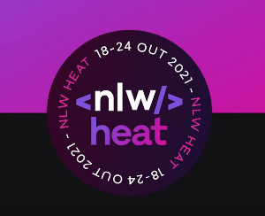
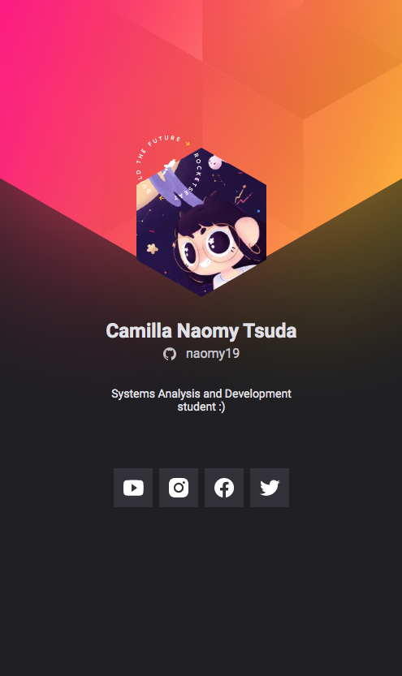

<h1 align="center">
    
</h1>

<h1 align="center">
   🚀 <a href="#"> EVENT BADGE </a>
</h1>

<h3 align="center">
    Event badge made in Rocketseat's NLW event.
</h3>

  
    
<!--     -->

<h4 align="center"> 
	 Status: Finished
</h4>

 <a href="#about">About</a> •
 <a href="#features">Features</a> •
 <a href="#layout">Layout</a> • 
 <a href="#author">Author</a>
<!--  <a href="#user-content-license">License</a>
 -->

## About

This is an event badge for mobile screen made with HTML, CSS and JavaScript.

Link for the badge: https://naomy19.github.io/cracha_nlw/

---

## Features

- [x] gets user info from github profile page JSON and shows in the badge

---

## Layout

  

---

## How to contribute

1. Fork the project.
2. Create a new branch with your changes: `git checkout -b my-feature`
3. Save your changes and create a commit message telling you what you did: `git commit -m" feature: My new feature "`
4. Submit your changes: `git push origin my-feature`
> If you have any questions check this [guide on how to contribute](./CONTRIBUTING.md)

---

## Author

<a href="https://github.com/naomy19">
 
  
 <b>Camilla Naomy Tsuda</b></a> 
  

 

---

<!-- ## License

This project is under the license [MIT](./LICENSE).

Made with love by  👋🏽 [Get in Touch!]() -->
<!-- 
--- -->

